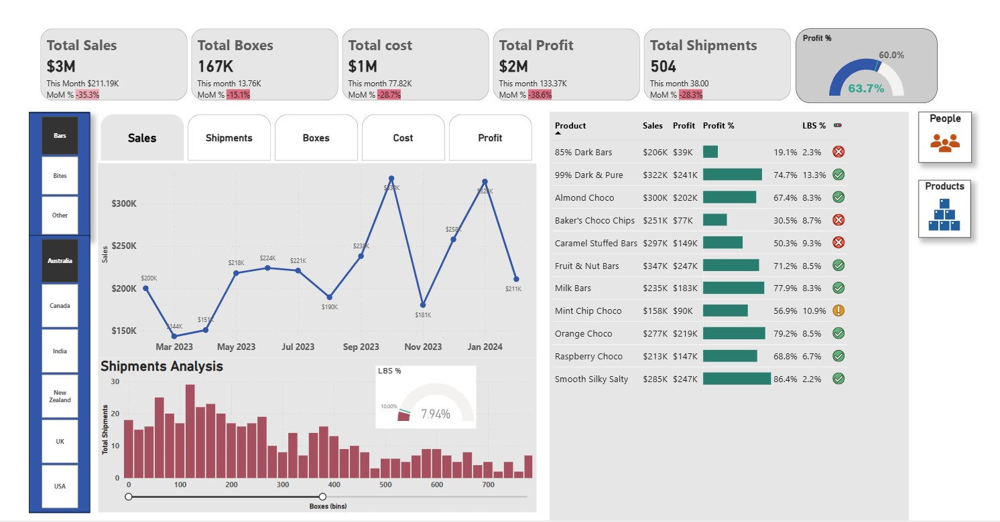
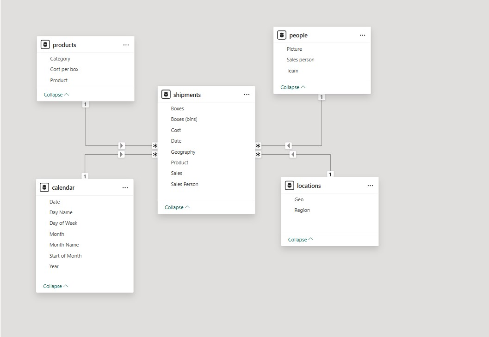

**Chocolate-sales-analytics**

**Project Overview**

Built a Power BI sales analytics solution for a chocolate company, built on 13 months of daily shipment data (Feb 2023–Feb 2024). The project implements a star-schema data model linking 6,000+ shipment records with calendar, product, salesperson, and geography dimensions to deliver interactive reporting and insights.

**Objectives**

The aim was to provide stakeholders with a single dashboard view of sales performance, profitability, and shipment behavior; enable month-over-month and year-over-year comparisons; support drill-down by product, salesperson, and region; and highlight low-volume shipments for operational improvement.

📌 **Attached Files for Reference**

📷   
📷   
📊 [ac-sample-data.xlsx](Dataset/ac-sample-data.xlsx)

**Key Technical Achievements**

Designed and deployed a star-schema in Power BI linking one fact (Shipments) and four dimension tables. Developed more than 12 DAX measures—including total sales, profit %, MoM/YoY calculations, and low-box shipment flags. Implemented trend charts, bookmark navigation, conditional formatting to enhance interactivity and usability.

**Key Metrics and Insights**

The dashboard is built on the data having $34 M in total revenue and 6,000+ shipments, revealing that around 10% of shipments comprised fewer than 50 boxes which are considered as low box shipments. Interactive KPI cards display sales, profit, shipment counts, profit percentages, and low-box rates, while dynamic histograms and trend lines enable rapid identification of performance shifts and outliers.

**My Key Learnings**

Gained mastery of star-schema modeling and advanced DAX for business intelligence. Enhanced skills in creating dynamic reports using field parameters, bookmarks, and custom tooltips. Learned best practices for report design, stakeholder-focused dashboarding, and deploying solutions via Power BI Service.

**Interactive Dashboard Link**

👉 [Click here to view Dashboard](https://app.powerbi.com/view?r=eyJrIjoiN2M3ODhkMmYtNjI4YS00NTA5LTgyYzgtZTk0ZWRmMWJlNGJjIiwidCI6ImM2ZTU0OWIzLTVmNDUtNDAzMi1hYWU5LWQ0MjQ0ZGM1YjJjNCJ9)
